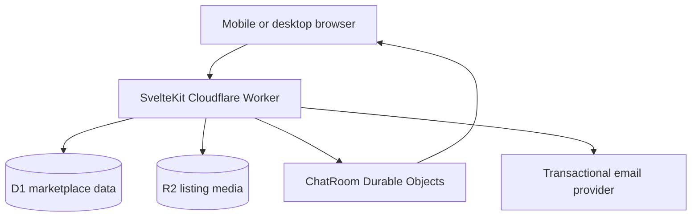

# Architecture

## System shape

The SvelteKit Worker is the only public application entry point. Public pages are server-rendered. Mutations use SvelteKit actions or narrow JSON endpoints. D1 owns authoritative relational state; R2 owns media bytes; Durable Objects coordinate ephemeral WebSocket presence and typing events. D1 messages remain the durable conversation record.

## Boundaries

- `src/lib/domain`: pure listing lifecycle and authorization values.
- `src/lib/server`: database access, authentication, crypto, validation, email, Turnstile and realtime classes. Never imported by client-only code.
- `src/routes`: SSR page loads, form actions and bounded API endpoints.
- `migrations`: ordered, production-safe schema changes. Taxonomy is configuration, not fake content.
- `static`: brand graphics, icons, manifest and public immutable files.
- `scripts/append-worker-exports.mjs`: adds the `ChatRoom` export to the adapter-generated Worker entry point after every build.

## Request lifecycle

`hooks.server.ts` creates a request identifier, hashes the opaque session cookie, resolves the active user, applies security headers and disables caching for private/API responses. Each mutation rechecks authentication, resource ownership or membership server-side. UI visibility is never treated as authorization.

## Authentication

Passwords use the Cloudflare Web Crypto PBKDF2 implementation with SHA-256, a per-password 144-bit salt and 310,000 iterations. Sessions are 256-bit opaque random tokens; D1 stores only SHA-256 token hashes. Cookies are HttpOnly, Secure in non-development environments, SameSite=Lax and path-scoped to `/`.

Verification and reset links use separately generated opaque tokens whose hashes, expiry and one-time use state are stored in D1. Email delivery is enabled only when provider credentials are configured.

## Listings and images

All categories use `listings` plus typed `category_attributes`/`listing_attributes`. Uploaded bytes are bounded, read server-side and checked by magic signature before R2 storage. D1 metadata controls ownership, order and the single cover image. Public media delivery checks listing visibility before reading R2.

V1 preserves originals and uses responsive browser sizing. A later isolated image-processing queue can add derived thumbnail/card/detail variants without changing listing identity or upload authorization.

## Realtime messaging

Conversation creation is listing-centric and unique per listing/buyer/seller triple. D1 stores messages and read state. A named `ChatRoom` Durable Object coordinates sockets for one conversation. The SvelteKit WebSocket endpoint verifies conversation membership before forwarding the upgrade. Typing and presence are transient; messages are first committed to D1, then broadcast.

## Caching and PWA

The service worker precaches versioned build/static files and the offline route. It does not intercept APIs or private account/auth/admin/messages routes. Navigation uses network-first fallback. Transactional state is never served from a stale cache.
